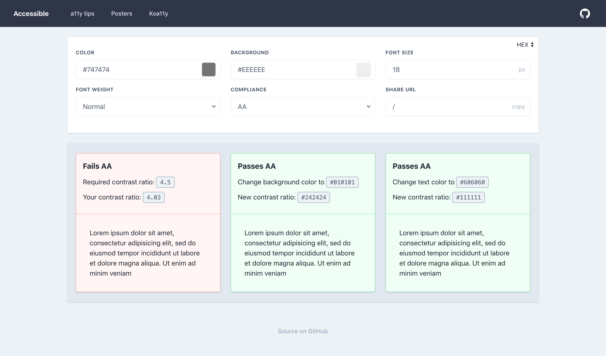

# a11y

> A site for checking if color combinations pass AA or AAA

## Screenshot



## Included

*TODO*

## Project setup

```
npm install
npm run serve
```

**Production build:**

```
npm run build
npm run deploy
```

## License

[LICENSE](LICENSE)
